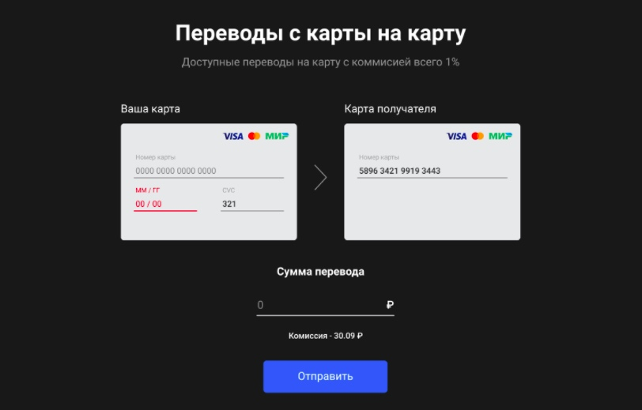

# **Курсовой проект "Сервис перевода денег"**
## Приложение предоставляет простой интерфейс перевода денег с карты на карту.

## **Задача проекта**
* Разработать backend приложение - REST-сервис.
* Сервис должен предоставить интерфейс для перевода денег с одной карты на другую по заранее описанной спецификации. 
* Заранее подготовленное веб-приложение (FRONT) должно подключаться к разработанному сервису без доработок и использовать его функционал для перевода денег.

## **Требования к приложению**
1. Сервис должен предоставлять REST интерфейс для интеграции с FRONT
Сервис должны реализовывать все методы перевода с одной банковской карты на другую описанные в протоколе https://github.com/netology-code/jd-homeworks/blob/master/diploma/MoneyTransferServiceSpecification.yaml
2. Все изменения должны записываться в файл (лог переводов в произвольном формате с указанием даты, времени, карта с которой было списание, карта зачисления, сумма, комиссия, результат операции если был)

## **Реализация:**
* Приложение (REST-сервис) разработано с использованием **Spring Boot**
* Сборщик пакетов - **maven**
* Для запуска используется **docker, docker-compose**
* **Unit** тесты с использованием **mockito**
* Интеграционные тесты с использованием **testcontainers**
* Логирование  - **log4j** (Логируются операции - уровень INFO и ошибки -уровень ERROR)
Запись логов в файле **moneyTransfer.log**
* Протестирован с помощью **Postman**


## **Запуск приложения:**
### 1. Для запуска REST-сервиса необходимо выполнить сборку проекта в терминале:

```
./mvnw clean package
```  
или  
```
mvn install
```

И далее запустить проект командой:
```
docker-compose up
```

В файле **requests_example.http** находятся примеры запросов для тестирование через Postman.

### 2. Для работы FRONT нужно :
-  Склонировать репозиторий по адресу https://github.com/serp-ya/card-transfer, 
- Открыть корневую директорию проекта и выполнить команду npm i. 
- Для запуска приложения необходимо в терминале выполнить команду 
```
npm run start 
```
в корневой папке front проекта. 

- Проект запустится по ссылке http://localhost:3000/

При удачном запуске нашего REST-сервиса и Front приложения, по адресу http://localhost:3000/ откроется вот такой интерфейс:




